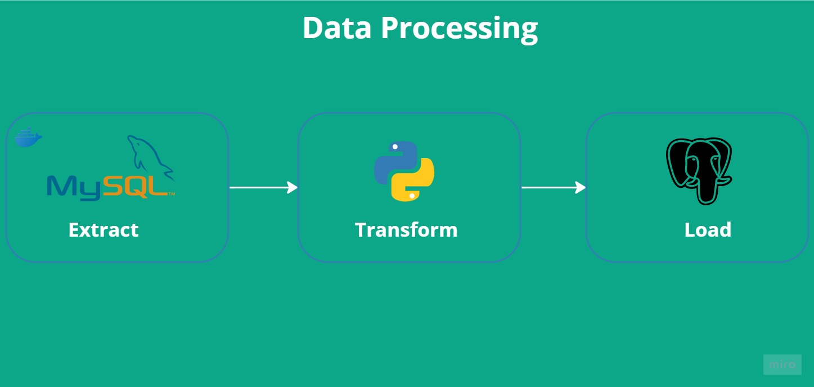

# Simple ETL Using Python

  

## Introductions
The objective of this project is to perform a simple Extract, Transform, Load (ETL) process using Python.
The data is extracted from the MySQL database, then transformed by cleaning up the column names, removing duplicate values, and handling missing values. Finally, the processed data is loaded back into the PostgreSQL database.

